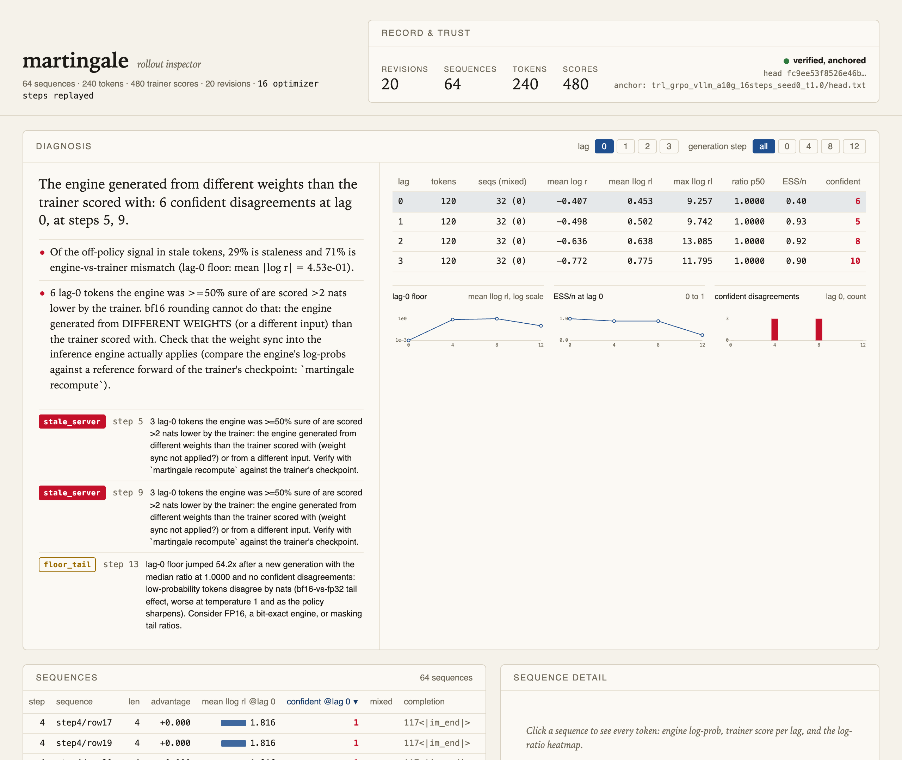
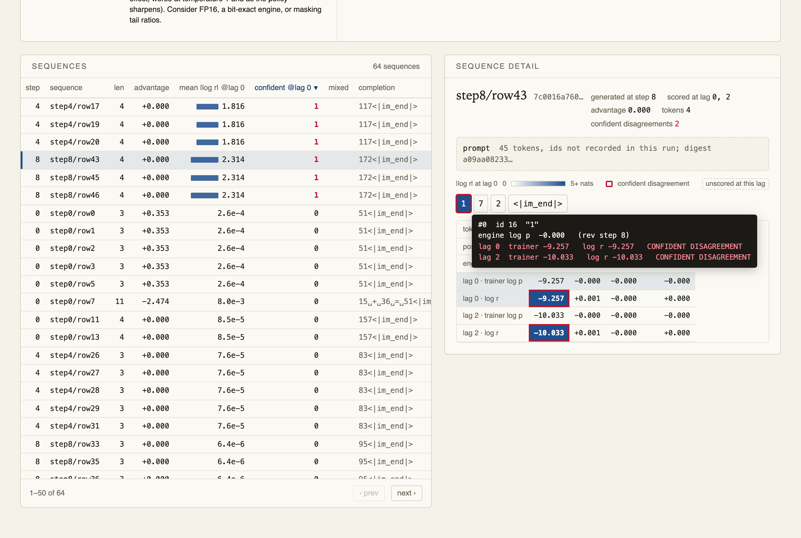

# The weight sync worked. Our fp32 trainer was invisible to its bf16 engine.

*A small GRPO run gave us a large lag-0 mismatch. We diagnosed it incorrectly twice before measuring the weights at the sync boundary.*

In online RL, we often call a sample “on policy” when the generator and trainer are at the same learner step. That label can hide a second question: did they assign the same probability to the tokens? We built a per-token record to answer it. Our first real run made the distinction painfully concrete.

The setup was Qwen2.5-0.5B-Instruct with TRL 1.13.0 GRPO and colocated vLLM 0.28.0 on one A10G. We ran 16 optimizer steps at learning rate `5e-6`, reusing each generation batch over four steps. The task was two-digit addition with exact-match reward. This is one model, seed, and configuration, rather than a general benchmark. The record joined each generated token's engine log-prob with its later trainer log-prob and learner revision. The independent checker verified the run against its recorded head.

At lag zero, the mean absolute log-ratio was about 0.45 nats across 120 scored tokens, with a maximum of 9.26. The median ratio was 1.0000. One answer, `172`, illustrates why the median was misleading: vLLM gave its first digit nearly probability one, while the trainer scored that same digit at about `-9.26` log-prob. The later digits agreed. On a nearly deterministic task, many easy tokens can agree while a few decision tokens disagree dramatically.

Our **first reading** was bf16 tail noise. We saw the unchanged median and reasoned that low-probability tokens differed in the numerical tail. That explanation failed on the first digit: this was a token the engine was highly confident about. We changed the alarm to flag “confident disagreement”: an engine probability of at least 50% and a trainer score more than two nats lower. It is a symptom rule, not a root-cause classifier.

Our **second reading** was a failed colocated weight sync. We rescored the recorded tokens on a CPU with the untouched initial checkpoint. At generation steps 4 and 8, the initial checkpoint differed from vLLM by only 0.0013 and 0.0006 nats on average, while it differed from the trainer by 0.8075 and 1.0289. It looked as if vLLM had kept the initial policy while the trainer moved. We said so. That was wrong too.

To settle the sync question, we instrumented the actual transfer. `sync_weights` ran at learner steps 0, 4, 8, and 12. After each transfer, we compared every live vLLM parameter with the corresponding trainer parameter cast to bf16, including Qwen2's fused projections and tied embedding. **Zero of 494,032,768 elements differed.** The step-8 transfer changed the engine's weights; it was no no-op. This probe measured the boundary that the offline checkpoint comparison could only suggest.

The trainer was loaded in float32 with `bf16=False`, so its forward used fp32 values. vLLM held bf16 weights. At step 4, the trainer's maximum drift from the initial checkpoint was `1.82e-5` per element; at step 12, `3.10e-5`. For a weight near the checkpoint's median magnitude, `0.0114`, one bf16 unit in the last place is about `6.1e-5`. Many fp32 Adam updates were therefore below a bf16 rounding boundary. The sync copied the *correctly rounded* values, but the fp32 forward saw changes that the bf16 engine could not represent. About 12.3% of engine elements had changed in bf16 by step 4 and 17.3% by step 12, yet its outputs on these tokens stayed close to the initial checkpoint at steps 4 and 8. That is a statement about this run's outputs, not proof that the engine weights never changed.

We then changed one variable: `bf16=True` for trainer autocast, leaving fp32 master weights and the rest of the recipe as before. The engine and trainer now agreed at lag zero at every generation. Their mean absolute log-prob differences were 0.0080, 0.0001, 0.0027, and 0.0274 nats at steps 0, 4, 8, and 12. The probe again found exact post-sync equality after the bf16 cast. At steps 8 and 12, both engine and trainer had moved several nats from the initial checkpoint. The doctor attributed 96% of this run's off-policy signal to staleness and 4% to engine/trainer mismatch.

The reward in that follow-up fell from 1.0 to 0.19 and then 0.0. This tiny task and learning recipe were unstable; we have not analyzed that collapse beyond the recorded trajectory. In the fp32 run, rewards had stayed at 1.0 over steps 5–12 because the engine kept answering effectively from the initial policy. That flat reward had concealed the divergence in the trainer's forward probabilities.

The practical check is to compare both *versions* and *numerical distributions*: retain engine log-probs, trainer log-probs, the actual sampler mode, and the weight revision for each generated token. If a lag-0 token has confident disagreement, inspect inputs, precision, and actual post-sync tensors before naming a failed transfer. A scalar `model_version` or median ratio alone cannot resolve the cause.

This observation corroborates the mechanism in Hugging Face's [“Defeating the trainer-generator precision mismatch in TRL”](https://aminedirohf-trainer-generator-bf16-mismatch.hf.space/), including its fp32 trainer / bf16 generator case. Our [probe, records, and limits](../findings/2026-10-06-trl-colocate-sync.md) show one concrete occurrence. They do not establish a failure rate across models, versions, engines, or RL tasks.
